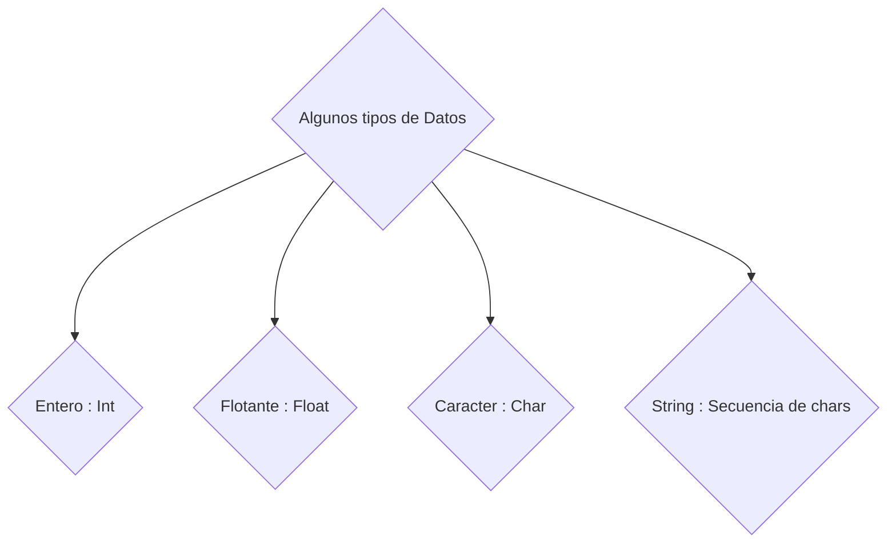

# Tamaño de los datos

Es importante antes de empezar a programar que existen diversos tipos de datos, tenemos valores enteros, decimales, caracteres únicos o lineas de texto que pueden ser bien extensas.

Cada uno de estos datos presenta un rango y peso en bytes que puede abarcar la variable, esto se puede analizar en la siguiente tabla: 

