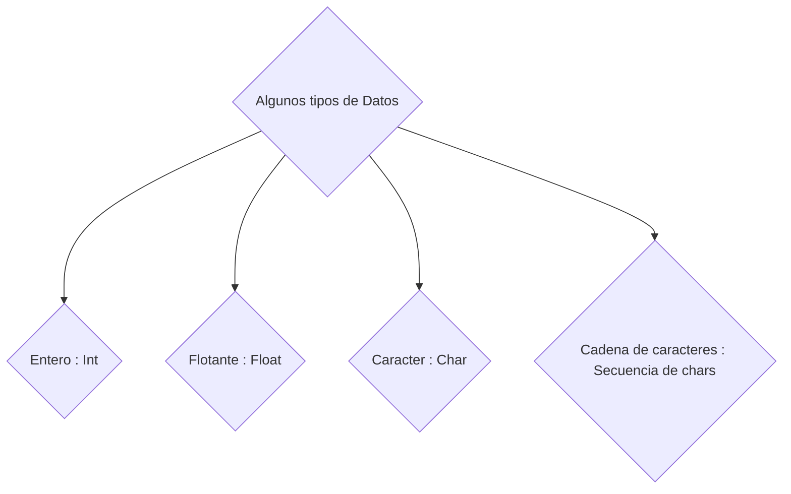

# Tamaño de los datos

Es importante antes de empezar a programar que existen diversos tipos de datos.

Cada uno de estos datos presenta un rango de valor y peso en bytes que puede abarcar la variable, esto se puede observar en la siguiente tabla de referencia: 

