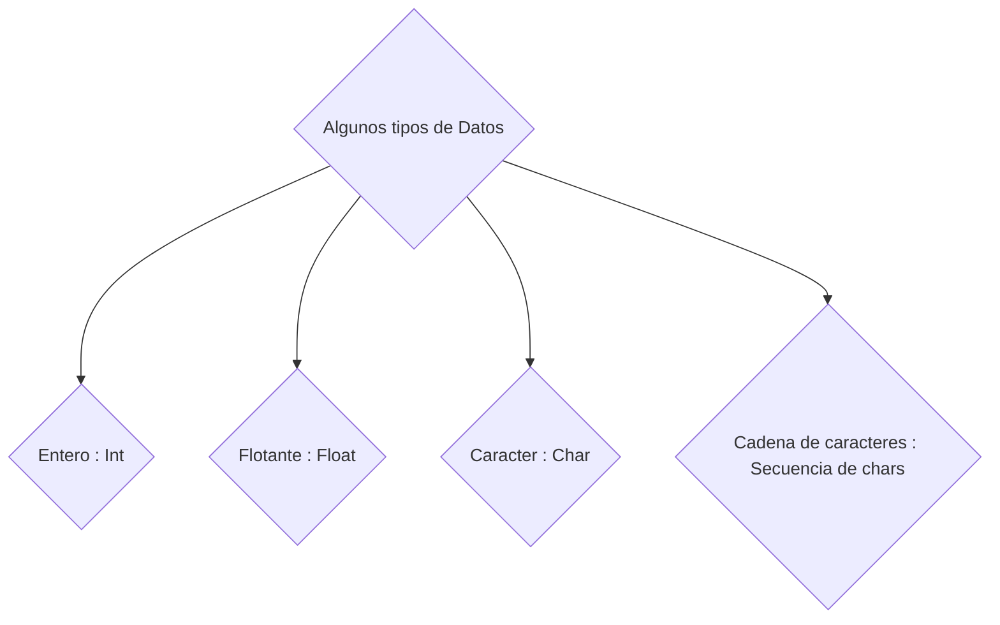

# Tamaño de los datos

Es importante antes de empezar a programar que existen diversos tipos de datos.



Cada uno de estos datos presenta un rango de valor y peso en bytes que puede abarcar la variable, esto se puede observar en la siguiente tabla de referencia: 


# Declaración de datos en lenguaje C

Ya vimos que en la tabla anterior que existen muchos tipos de datos en C, para poder declarar un dato en C te mostraré un código de ejemplo en donde utilizaremos los tipos de datos ( Int, Float, Char único, Arreglos de chars y punteros). 


## Código de ejemplo

```c
 #include <stdio.h>

int main(){
    int entero = 4; // Variable de tipo "Int" o entero
    float decimal = 3.16; // Variable del tipo "Float" o decimal
    char letra = 'A'; // Variable del tipo "Char" o un caracter en especifico 
    char cadena_de_texto[] = "Esta es una cadena"; // Variable del tipo "Arreglo de caracteres" , que son variables con más de 1 caracter
    int *puntero; // Variable del tipo puntero los cuales "apuntan" a un espacio de memoria
    return 0;
}
```

# Función printf()

Sabemos que existen varios tipos de datos en el lenguaje C, pero una cosa importante es saber que existen
y otra también bastante importante es poder desplegar estos valores en la terminal y así poder realizar 
 corroboraciones de los datos o simplemente un seguimiento de que esté todo como debería.

 Para eso se utiliza la función "printf()", su principal propósito es permitir que los programadores formateen y muestren texto y valores de variables en la salida estándar, la sintaxis de la función es la siguiente:

```c
// Declaración de variable int por ejemplo

#include <stdio.h>

int main(){
    int valor = 4;
    printf("%d", valor); // Deberias ver un 4 en la terminal
    return 0;
}
```

Si te diste cuenta, introduje un % seguido de una letra d (en este caso), estas letras no están por qué sí,
sino que sirven para indicar al programa en qué parte del texto ingresar la variable dentro del printf, 
a la par que define el tipo de dato que vamos a desplegar. 

## Jugando con la posición 

```c
#include <stdio.h>

int main(){
    int valor = 4;
    printf("%d\n", valor);
    printf("Texto a la izquierda del valor --> %d\n", valor); 
    printf("%d <-- Texto a la derecha del valor\n", valor);
    return 0;
}
```

Salida del código

```
4
Texto a la izquierda del valor --> 4
4 <-- Texto a la derecha del valor
```

También puedes notar que agregué **"\n"** al final de cada entre comillas doble "" , esto es para marcar un salto de línea así evitamos que se imprima todo junto entre un printf y el otro.

## Nomenclatura de los datos (printf())
Existe una letra o caracter en específico para cada uno de los tipos de datos:
* %d o %i: Entero con signo (int).
* %u: Entero sin signo (unsigned int).
* %f: Número de punto flotante (float o double).
  * Si queremos un numero fijo de decimales hay que usar la nomenclatura %0.2f (2 decimales después de la coma, por ejemplo).
* %c: Carácter individual.
* %s: Cadena de caracteres (puntero a char).
* %x o %X: Entero en formato hexadecimal.
* %o: Entero en formato octal.
* %p: Dirección de memoria (puntero).
* %e o %E: Notación científica de punto flotante.

## Código de ejemplo

```c
#include <stdio.h>

int main(){
    // Tomemos de ejemplo los tipos de datos: int, float, char y una cadena de chars
    int entero = 4;
    float decimal = 4.15321;
    char letra = 'A';
    char cadena[] = "Hola que tal todo";
    int *puntero;

    printf("Este es un dato del tipo entero: %d\n", entero);
    printf("Este es un dato del tipo flotante: %f\n", decimal);
    printf("Este es un dato del tipo flotante acotado: %0.2f\n", decimal);
    printf("Este es un dato del tipo char: %c\n", letra);
    printf("Este es un dato del tipo cadena de caracteres: %s\n", cadena);
    printf("Este es un dato del tipo puntero: %p\n", puntero);
    
    return 0;
}
```

Salida del código

```
Este es un dato del tipo entero: 4
Este es un dato del tipo flotante: 4.153210
Este es un dato del tipo flotante acotado: 4.15
Este es un dato del tipo char: A
Este es un dato del tipo cadena de caracteres: Hola que tal todo
Este es un dato del tipo puntero: 000000000000002e
```
