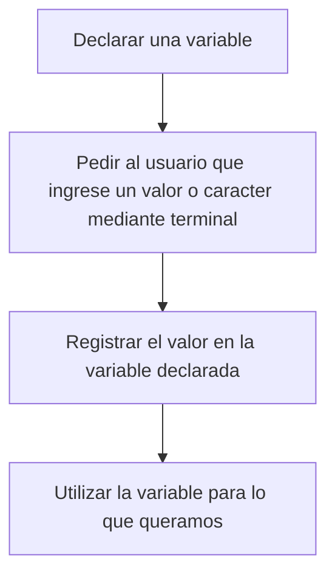

# 1) Ingreso de datos con Scanf()

Si queremos ingresar o pedirle al usuario que ingrese datos del tipo Int, Float, Char. La función scanf() es la más común de implementar en este tipo de ambitos 

La sintaxis de la función scanf() es la siguiente: 

```c
scanf("%d o %f o %c", &variable);
```

Si te diste cuenta tiene una sintaxis similar a la del printf(), en donde primero tenemos que definir el tipo de variable que vamos a leer por la terminal
y posteriormente darle la dirección (&) de la variable a la que queremos asignarle ese valor, esto por requerimientos de la función

Generalmente la lógica detras de esto seguiría un patron algo así: 



## 1.1) Ejemplo en código
```c
#include <stdio.h> 

int main(){
    int valor1;
    float valor2;
    char valor3;

    printf("Ingrese un valor entero: ");
    scanf("%d", &valor1);

    printf("Ingrese un valor decimal: ");
    scanf("%f", &valor2);

    printf("Ingrese un caracter: ");
    scanf(" %c", &valor3);

    printf("El entero que usted ingreso fue: %d\n", valor1); 
    printf("El decimal que usted ingreso fue: %f\n", valor2);
    printf("El caracter que usted ingreso fue: %c\n", valor3);

    return 0;
}
```

Salida del código: 

```
Ingrese un valor entero: 540
Ingrese un valor decimal: 5.42312
Ingrese un caracter: O
El entero que usted ingreso fue: 540
El decimal que usted ingreso fue: 5.423120
El caracter que usted ingreso fue: O
```

En el código anterior nótese el espacio en:

```c
    scanf(" %c", &valor3);
```

Esto es debido al orden en que realizamos los scanf() y también porque en C existe un caracter oculto que está intrinsico en cada mensaje que es un "\0" 
Este caracter marca el final de una cadena o un espacio, por eso siempre que definamos un caracter tenemos que considerar el n+1 
siendo n el total de letras o valores que tendrá el char y 1 extra para el caracter intrínsico que tiene C.

En el ejemplo, para que se pudiese realizar bien la lectura del char tuve que darle ese espacio, pero si el codigo fuese como aparecerá abajo realizando la lectura del char primero, no habría ningun problema, te invito a probar ambas versiones jugando con el espacio en el scanf() del char.

```c
#include <stdio.h> 

int main(){
    int valor1;
    float valor2;
    char valor3;

    printf("Ingrese un caracter: ");
    scanf("%c", &valor3);

    printf("Ingrese un valor entero: ");
    scanf("%d", &valor1);

    printf("Ingrese un valor decimal: ");
    scanf("%f", &valor2);

    printf("El entero que usted ingreso fue: %d\n", valor1); 
    printf("El decimal que usted ingreso fue: %f\n", valor2);
    printf("El caracter que usted ingreso fue: %c\n", valor3);

    return 0;
}
```

## 1.2) Ingreso de multiples variables con scanf()
No solamente puedes ingresar 1 solo valor con scanf(), si no que puedes hacerlo con multiples variables separados por un espacio.

## 1.2.1) Ejemplo en código

```c
#include <stdio.h> 

int main(){
    int valor1;
    float valor2;

    printf("Ingrese un valor entero y otro decimal separados por un espacio: ");
    scanf("%d %f", &valor1, &valor2);

    printf("Usted ingreso : (%d y %f)", valor1,valor2);

    return 0;
}
```

Salida del codigo

```
  Ingrese un valor entero y otro decimal separados por un espacio: 5421 5.421
  Usted ingreso : (5421 y 5.421000)
```

# 2) Ingreso de datos con fgets()

Otra función bastante utilizada es fgets(), esta función lo que hace es leer una linea completa considerando espacios en el texto.

La sintaxis de la función es: 

```c
  char texto[80];
  fgets(texto,80,stdin);
```

En donde primero tenemos que definir una cadena de caracteres con un tamaño cualquiera sea nuestro interés. El primer valor de fgets() corresponde al nombre de la variable, el segundo al tamaño y stdin significa que el texto ingresado será a traves del teclado.


## 2.1) Ejemplo en código

```c
#include <stdio.h> 

int main(){

    char texto_extenso[80];

    printf("Escriba algo al azar: ");

    fgets(texto_extenso,80,stdin);

    printf("Escribiste: %s", texto_extenso);

    return 0;
}
```

Salida del código 

```
  Escriba algo al azar: Este es un texto extenso de prueba
  Escribiste: Este es un texto extenso de prueba
```
