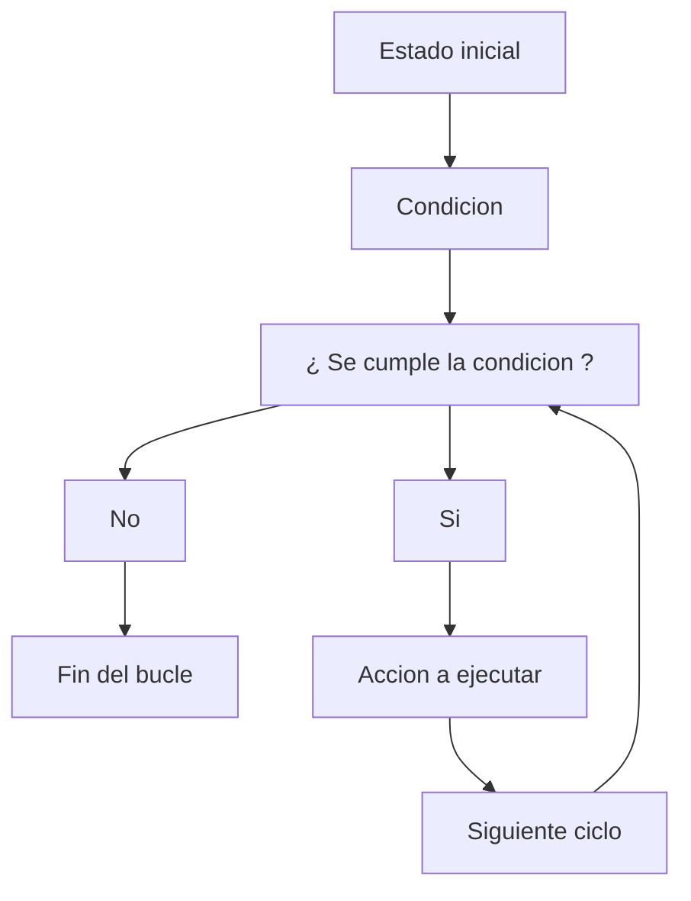

En C, los bucles (o ciclos) permiten ejecutar repetidamente un bloque de código mientras se cumpla una condición determinada. 
Los bucles son fundamentales para realizar tareas repetitivas de manera eficiente.

Generalmente la estructura que siguen los bucles es la siguiente: 



# 1) Bucle for
El bucle "for" generalmente se utiliza cuando uno conoce el rango de acción de la tarea que quiere ejecutar.

Este bucle esta dividido en 3 partes muy importantes que serian: 
* **Inicialización** : Esta parte es donde se define en que punto empieza el ciclo / bucle.
* **Condición** : Aqui se marcan las reglas en las que se basará el bucle, si se cumple la regla pasará a la siguiente acción, en caso contrario se romperá el ciclo.
* **Incremento / Decremento** : Esto marca una actualización en la variable de control, sin esto el bucle entraría en un loop infinito.

en código el bucle for se vería así: 

```c
for(inicialización;condición;incremento/decremento){
  acciones que se quieran realizar
}
```

## 1.1) Ejemplos en código

```c
  #include <stdio.h> 
  
  int main(){
      int i;
      for(i=0; i<5; i++){ 
          printf("Valor de i : %d\n", i);
      }
      printf("Fin del bucle");
      return 0;
  }
```

Salida del codigo

```
Valor de i : 0
Valor de i : 1
Valor de i : 2
Valor de i : 3
Valor de i : 4
Fin del bucle
```
Otro ejemplo con decremento

```c
#include <stdio.h> 

int main(){
    int i;
    for(i=10; i>=0; i--){ 
        printf("Valor de i : %d\n", i);
    }
    printf("Fin del bucle");
    return 0;
}
```
Salida del código 

```
Valor de i : 10
Valor de i : 9
Valor de i : 8
Valor de i : 7
Valor de i : 6
Valor de i : 5
Valor de i : 4
Valor de i : 3
Valor de i : 2
Valor de i : 1
Valor de i : 0
Fin del bucle
```

# 2) Bucle while
Este bucle es bastante util cuando no sabes cuantas veces necesitas repetir el ciclo de una tarea pero si sabes que es necesario realizar algo mientras se cumpla una condición

Este bucle sigue una estructura bastante parecida al for, solamente que la forma de escribirlo es distinta, en pseudo-codigo se veria algo asi:

```c
  Declarar variable;
  while (Condición en función de la variable){
  Acción
  Incremento/decremento
  }
```
## 2.1) Ejemplos en código

```c
  #include <stdio.h> 
  
  int main(){
      int i = 0;
      while (i<=5){
          printf("Valor de i : %d\n", i);
          i++;
      }
      
      printf("Fin del bucle");
      return 0;
  }
```

Salida del código 

```
Valor de i : 0
Valor de i : 1
Valor de i : 2
Valor de i : 3
Valor de i : 4
Valor de i : 5
Fin del bucle
```

Otro ejemplo

```c
  #include <stdio.h> 
  
  int main(){
      int i = 25;
      while (i!=20){
          printf("Valor de i : %d\n", i);
          i--;
      }

      printf("Fin del bucle");
      return 0;
  }
```

Salida del código

```
Valor de i : 25
Valor de i : 24
Valor de i : 23
Valor de i : 22
Valor de i : 21
Fin del bucle
```

# 3) Bucle do-while 

A diferencia del bucle while, este código presenta una característica bastante interesante y es que el bloque de código se ejecutará almenos 1 vez,
 ya que la verificación de la condición se hace finalizado el primer ciclo.

 Su estructura en pseudo-codigo sería:
 
```c
 do {
    // Código de ejecución inicial
} while (condición);
```

## 3.1) Ejemplos en código

```c
#include <stdio.h> 

int main(){
    int i = 4;

    do {
        printf("Valor de i: %d\n", i);
        i++;
    } while (i<=9);
 
    printf("Fin del bucle");
    return 0;
}
```

Salida del código 

```
Valor de i: 4
Valor de i: 5
Valor de i: 6
Valor de i: 7
Valor de i: 8
Valor de i: 9
Fin del bucle
```

Otro ejemplo sería:

```c
#include <stdio.h> 

int main(){
    int i = 27;

    do {
        printf("Valor de i: %d\n", i);
        i--;
    } while (i>=15);
 
    printf("Fin del bucle");
    return 0;
}
```

Salida del código

```
Valor de i: 27
Valor de i: 26
Valor de i: 25
Valor de i: 24
Valor de i: 23
Valor de i: 22
Valor de i: 21
Valor de i: 20
Valor de i: 19
Valor de i: 18
Valor de i: 17
Valor de i: 16
Valor de i: 15
Fin del bucle
```

# 4) Uso de break y continue

Dentro de los ciclos también podemos realizar excepciones en el caso de que hayan ciertos valores o recorridos que no sean de nuestro interes.

## 4.1) Break 
La función de "break" como bien lo dice su nombre es el de "romper" el bucle, imaginemos que queremos realizar un ciclo "for" en un rango de valores de interes,
 pero que si el valor que estamos iterando llegase a alcanzar cierto numero, eso podria darnos problemas a nuestro código, en este tipo de casos lo ideal sería 
 terminal el ciclo para evitar cualquier error.

 ## 4.1.1) Ejemplos en código
```c
#include <stdio.h> 

int main(){
    int i;
    
    for (i=0; i<10; i++){

        if(i==7){
            printf("El valor de i llego a 7, cerrando el bucle\n");
            break;
        }
        
        printf("Valor de i: %d\n", i);
        
    }

    printf("Fin del bucle");
    return 0;
}
```

Salida del codigo

```
Valor de i: 0
Valor de i: 1
Valor de i: 2
Valor de i: 3
Valor de i: 4
Valor de i: 5
Valor de i: 6
El valor de i llego a 7, cerrando el bucle
Fin del bucle
```

En el código de arriba el "i" debió haber recorrido todos los valores desde el 0 al 10, pero como nosostros indicamos el condicional que si el valor fuese 7 en algún punto se rompiese el ciclo, el bucle llegó hasta esa instancia y terminó.


Otro ejemplo

```c
#include <stdio.h> 

int main(){
    int i;
    
    for (i=15; i>=4; i--){
        
        if(i==7){
            printf("El valor de i llego a 7, cerrando el bucle\n");
            break;
        }

        printf("Valor de i: %d\n", i);
        
    }

    printf("Fin del bucle");
    return 0;
}
```

Salida del codigo

```
Valor de i: 15
Valor de i: 14
Valor de i: 13
Valor de i: 12
Valor de i: 11
Valor de i: 10
Valor de i: 9
Valor de i: 8
El valor de i llego a 7, cerrando el bucle
Fin del bucle
```

 ## 4.2) Continue

 A diferencia de "break" lo que hace a "continue" especial es que en vez de romper y finalizar el ciclo, este se salta la instancia que nosotros definimos y pasa a la siguiente sin iterar en el valor.

 ## 4.2.1) Ejemplos en código
 
```c
#include <stdio.h> 

int main(){
    int i;
    
    for (i=0; i<10; i++){

        if(i==7){
            printf("El valor de i llego a 7, saltando al siguiente valor del bucle\n");
            continue;;
        }
        
        printf("Valor de i: %d\n", i);
        
    }

    printf("Fin del bucle");
    return 0;
}
```

Salida del código

```
Valor de i: 0
Valor de i: 1
Valor de i: 2
Valor de i: 3
Valor de i: 4
Valor de i: 5
Valor de i: 6
El valor de i llego a 7, saltando al siguiente valor del bucle
Valor de i: 8
Valor de i: 9
Fin del bucle
```

Si te diste cuenta el codigo no iteró en el valor 7, si nó que solamente se salto al siguiente, si comparamos el continue con el break, el continue si realizó el recorrido completo por todos los valores excepto el que se definió en el "if"

Otro ejemplo

```c
#include <stdio.h> 

int main(){
    int i;
    
    for (i=15; i>=4; i--){

        if(i==7){
            printf("El valor de i llego a 7, saltando al siguiente valor  del bucle\n");
            continue;
        }

        printf("Valor de i: %d\n", i);
        
    }

    printf("Fin del bucle");
    return 0;
}
``` 

Salida del código

```
Valor de i: 15
Valor de i: 14
Valor de i: 13
Valor de i: 12
Valor de i: 11
Valor de i: 10
Valor de i: 9
Valor de i: 8
El valor de i llego a 7, saltando al siguiente valor  del bucle
Valor de i: 6
Valor de i: 5
Valor de i: 4
Fin del bucle
```
