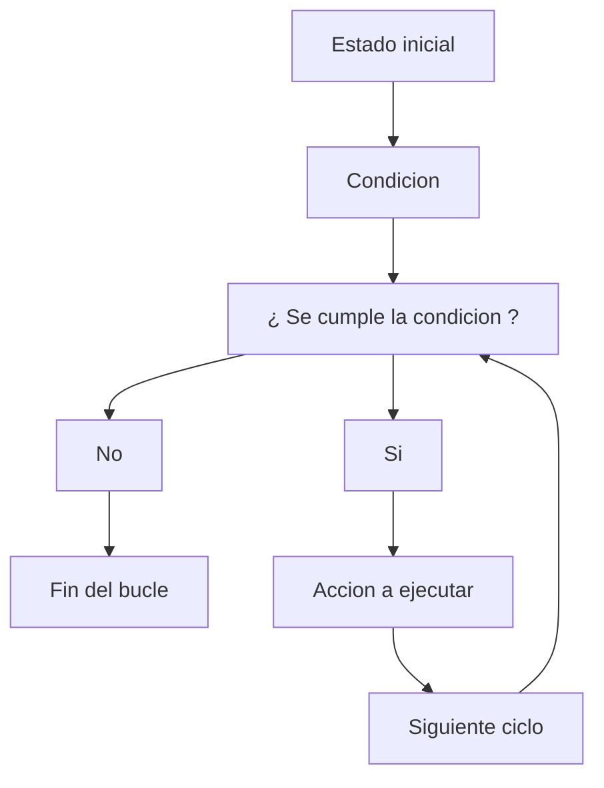

En C, los bucles (o ciclos) permiten ejecutar repetidamente un bloque de código mientras se cumpla una condición determinada. 
Los bucles son fundamentales para realizar tareas repetitivas de manera eficiente.

Generalmente la estructura que siguen los bucles es la siguiente: 



# 1) Bucle for
El bucle for generalmente se utiliza cuando uno conoce el rango de accion de la tarea que quiere ejecutar.

Este bucle esta dividido en 3 partes muy importantes que serian: 
* **Inicializacion** : Esta parte es donde se define en que punto inicia el ciclo / bucle.
* **Condicion** : Aqui se marcan las reglas en las que se basara el bucle, si se cumple la regla pasara a la siguiente accion, en caso contrario se rompera el ciclo.
* **Incremento / Decremento** : Esto marca una actualizacion en la variable de control, sin esto el bucle entraria en uno infinito.

en codigo el bucle for se veria asi: 

```c
for(inicializacion;condicion;incremento/decremento){
  acciones que se quieran realizar
}
```
## 1.1) Ejemplos en código
```c
  #include <stdio.h> 
  
  int main(){
      int i;
      for(i=0; i<5; i++){ 
          printf("Valor de i : %d\n", i);
      }
      printf("Fin del bucle");
      return 0;
  }
```
Salida del codigo

```
Valor de i : 0
Valor de i : 1
Valor de i : 2
Valor de i : 3
Valor de i : 4
Fin del bucle
```
Otro ejemplo con decremento

```c
#include <stdio.h> 

int main(){
    int i;
    for(i=10; i>=0; i--){ 
        printf("Valor de i : %d\n", i);
    }
    printf("Fin del bucle");
    return 0;
}
```
Salida del codigo 

```
Valor de i : 10
Valor de i : 9
Valor de i : 8
Valor de i : 7
Valor de i : 6
Valor de i : 5
Valor de i : 4
Valor de i : 3
Valor de i : 2
Valor de i : 1
Valor de i : 0
Fin del bucle
```

# 2) Bucle while
Este bucle es bastante util cuando no sabes cuantas veces necesitas repetir el ciclo de una tarea pero si sabes que es necesario realizar algo mientras se cumpla una condicion

Este bucle sigue una estructura bastante parecida al for, solamente que la forma de escribirlo es distinta, en pseudo-codigo se veria algo asi:

```c
  Declarar variable;
  while (Condicion en funcion de la variable){
  Accion
  Incremento/decremento
  }
```
## 2.1) Ejemplos en código

```c
  #include <stdio.h> 
  
  int main(){
      int i = 0;

      while (i<=5){
          printf("Valor de i : %d\n", i);
          i++;
      }
      
      printf("Fin del bucle");
      return 0;
  }
```

Salida del codigo 

```
Valor de i : 0
Valor de i : 1
Valor de i : 2
Valor de i : 3
Valor de i : 4
Valor de i : 5
Fin del bucle
```

Otro ejemplo

```c
  #include <stdio.h> 
  
  int main(){
      int i = 25;

      while (i!=20){
          printf("Valor de i : %d\n", i);
          i--;
      }

      printf("Fin del bucle");
      return 0;
  }
```

Salida del codigo

```
Valor de i : 25
Valor de i : 24
Valor de i : 23
Valor de i : 22
Valor de i : 21
Fin del bucle
```

# 3) Bucle do-while 

A diferencia del bucle while, este codigo presenta una caracteristica bastante interesante y es que el bloque de codigo se ejecutara almenos 1 vez,
 ya que la verificacion de la condicion se hace finalizado el primer ciclo

 Su estructura en pseudo-codigo seria:
 
```c
 do {
    // Código de ejecucion inicial
} while (condición);
```

## 3.1) Ejemplos en código
```c
#include <stdio.h> 

int main(){
    int i = 4;

    do {
        printf("Valor de i: %d\n", i);
        i++;
    } while (i<=9);
 
    printf("Fin del bucle");
    return 0;
}
```

Salida del codigo 

```
Valor de i: 4
Valor de i: 5
Valor de i: 6
Valor de i: 7
Valor de i: 8
Valor de i: 9
Fin del bucle
```
Otro ejemplo seria:

```c
#include <stdio.h> 

int main(){
    int i = 27;

    do {
        printf("Valor de i: %d\n", i);
        i--;
    } while (i>=15);
 
    printf("Fin del bucle");
    return 0;
}
```

Salida del codigo

```
Valor de i: 27
Valor de i: 26
Valor de i: 25
Valor de i: 24
Valor de i: 23
Valor de i: 22
Valor de i: 21
Valor de i: 20
Valor de i: 19
Valor de i: 18
Valor de i: 17
Valor de i: 16
Valor de i: 15
Fin del bucle
```

# Uso de break y continue
